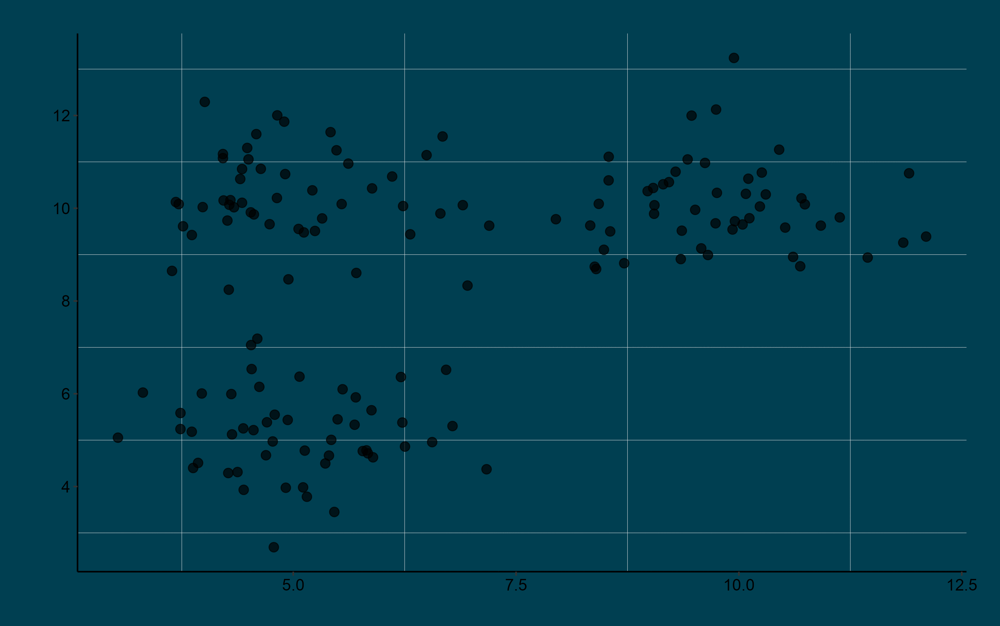

# The Dream Team

<div class="square-container">

  <div class="square">
    <div class="circular-image">
      
    </div>
    <div class="image-caption">Andrew Van Burgel</div>
  </div>

  <div class="square">
    <div class="circular-image">
      
    </div>
    <div class="image-caption">Karyn Reeves</div>
  </div>

  <div class="square">
    <div class="circular-image">
      
    </div>
    <div class="image-caption">Chris Shaw</div>
  </div>

  <div class="square">
    <div class="circular-image">
      
    </div>
    <div class="image-caption">Tinula Kariyawasam</div>
  </div>

</div>

---


<div class="square-container">
  <div class="square">
    <ul>
      <li>Honours Statistics UWA</li>
      <li>Since 2003 – Albany</li>
      <li>Crop research, livestock, horticulture</li>
    </ul>
    <div class="image-caption">"The Veteran"</div>
  </div>

  <div class="square">
    <ul>
      <li>PhD Biostatistics Murdoch</li>
      <li>Since 2013 Nash St</li>
      <li>Genetics, grains</li>
    </ul>
    <div class="image-caption">"Ms. Reliable"</div>
  </div>

  <div class="square">
    <ul>
      <li>PhD Ecology Murdoch</li>
      <li>Since 2023 Nash St </li>
      <li>Rangelands, Horticulture</li>
    </ul>
    <div class="image-caption">Rookie</div>
  </div>

  <div class="square">
    <ul>
      <li>Honours Statistics UWA </li>
      <li>Since 2022 Nash St</li>
      <li>WAFS project</li>
    </ul>
    <div class="image-caption">"Tech Wizard"</div>
  </div>

</div>

---

<div class="main-title">Department Wide Statistical Support</div>
<div class="sidebar-container">
  <div class="sidebar-title active">Consult</div>
  <div class="sidebar-title">Design</div>
  <div class="sidebar-title">Analyse</div>
  <div class="sidebar-title">Observational</div>
</div>

<div class="ron-centered-container">
  
</div>

<div class="quote" id="quote1">"Can't we just skip the control group? It seems like a waste"</div>
<div class="quote" id="quote2">"Why do I need to randomise the plots? All the fields are essentially the same"</div>
<div class="quote" id="quote3">"Do we really need replicates? They seem redundant."</div>
<div class="quote" id="quote4">"What do you mean by 'factorial structure'?"</div>
<div class="quote" id="quote5">"It's too hard to randomise the treatment."</div>
<div class="quote" id="quote6">"Give me the exact number of samples."</div>
---

<div class="main-title">Department Wide Statistical Support</div>
<div class="sidebar-container">
  <div class="sidebar-title">Consult</div>
  <div class="sidebar-title active">Design</div>
  <div class="sidebar-title">Analyse</div>
  <div class="sidebar-title">Observational</div>
</div>


<div class="design-centered-container">
  
</div>

---

<div class="main-title">Department Wide Statistical Support</div>
<div class="sidebar-container">
  <div class="sidebar-title">Consult</div>
  <div class="sidebar-title">Design</div>
  <div class="sidebar-title active">Analyse</div>
  <div class="sidebar-title">Observational</div>
</div>

.right-plot[
```{r plot1-plot2, echo=FALSE, warning=FALSE, out.width="80%"}
library(ggplot2)
library(theme.dpird)
library(gridExtra)

# Dummy data for the bar plot
set.seed(123)
df1 <- data.frame(
  treatment = factor(c("Magneta", "Trojan", "Janz", "Scout")),
  y_variate = rnorm(4, 10, 2)
)

p1 <- ggplot(df1, aes(treatment, y_variate, fill = as.factor(treatment))) +
  geom_bar(stat="identity") +
  theme_dpird(minor_grid = T) +
  theme(legend.position="none", plot.background = element_rect(fill = "#003F51"), panel.background = element_rect(fill = "#003F51")) + 
  labs(x = "", y = "")

# Dummy data for the line plot
set.seed(2023)
df2 <- data.frame(
  REP = rep(factor(1:5), each=4),
  y_variate = rnorm(20, 50, 20),
  group = factor(rep(1:4, 5))
)

p2 <- ggplot(df2, aes(REP, y_variate, color=group, group=group)) +
  geom_line() +
  theme_dpird(minor_grid = T) +
  theme(legend.position="none", plot.background = element_rect(fill = "#003F51"), panel.background = element_rect(fill = "#003F51")) +
  labs(y = "Yield")

#Print the plots
# print(p1)
# print(p2)
grid.arrange(p1, p2)
```
]

<div class="lsdMeme">
    
</div>

---

<div class="main-title">Department Wide Statistical Support</div>
<div class="sidebar-container">
  <div class="sidebar-title">Consult</div>
  <div class="sidebar-title">Design</div>
  <div class="sidebar-title">Analyse</div>
  <div class="sidebar-title active">Observational</div>
</div>


<div class="grid-container">
  <div class="grid-item">
    <div class="gif-title">Bayesian Inference</div>
    
  </div>
  <div class="grid-item">
    <div class="gif-title">Predictive Analysis</div>
    
  </div>
  <div class="grid-item">
    <div class="gif-title">High Dimensional Inference</div>
    
  </div>
  <div class="grid-item">
    <div class="gif-title">Classification</div>
    
  </div>
</div>


---

### Output + Innovation 

* Publications 

* Developments;
  + Shiny apps 
  + Website
  
* Collaborations

* Attending + Speaking at conferences


